---
title: " Календарный эффект для моментум-стратегии и reality check **Индия** (данные с нулями)"
output:
  html_document:
      pandoc_args: [
      "+RTS", "-K64m",
      "-RTS"
    ]
lang: russian
---

 

  
 
  
>Количество исследумых компаний -- **190** 

 
 

  

>Период отслеживания менялся от **1** до **12** месяцев

>Период ожидания менялся от **0** до **8** недель

>Период инвестирования менялся от **1** до **12** месяцев

 
 

  

## 1. Моментум стратегии при равных весах. Ранжирование по средней доходности (бенчмарк 6% годовых - только для reality check)

 

  
>Всего было рассмотрено **5184** стратегий

 
 

  
====================================================================================================================================================

>**Понедельник**

>Лучшая по средней доходности стратегия дает среднемесячную доходность **1.32** **%** и имеет параметры:
>период отбора -- **3** месяцев,  период ожидания -- **2** недель, период инвестирования -- **1** месяцев,  процентиль -- **0.1** 

 

 

>**Вторник**

>Лучшая по средней доходности стратегия дает среднемесячную доходность **1.28** **%** и имеет параметры:
>период отбора -- **7** месяцев,  период ожидания -- **6** недель, период инвестирования -- **1** месяцев,  процентиль -- **0.1** 

 

 

====================================================================================================================================================

>**Понедельник**

>Bootstrap p-value равен  **0.518**

 

 

>Всего портфелей у лучшей стратегии -- **456** 
>Количество отрицательных доходностей у лучшей стратегии -- **187** ( **41.01%** )
 

 

  

####**Рисунок 1. ** 

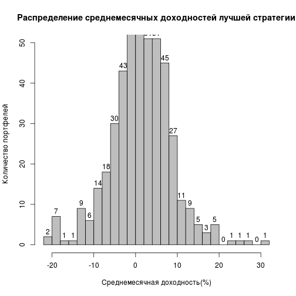 

  

  

>**Вторник**

>Bootstrap p-value равен  **0.552**

 

 

>Всего портфелей у лучшей стратегии -- **456** 
>Количество отрицательных доходностей у лучшей стратегии -- **167** ( **36.62%** )
 

 

  

####**Рисунок 2. ** 

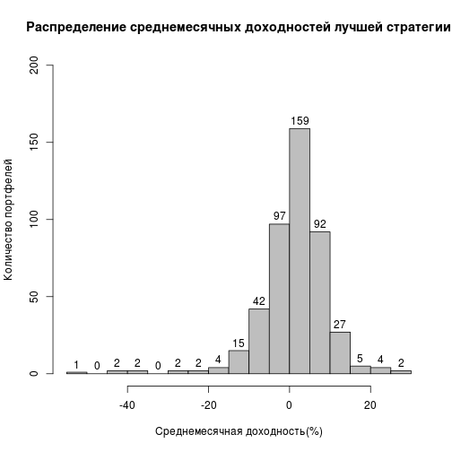 

  

  

====================================================================================================================================================

>**Понедельник**

  

  

####**Рисунок  3. (вертикальные пунктирные линии - начало нового года) ** 

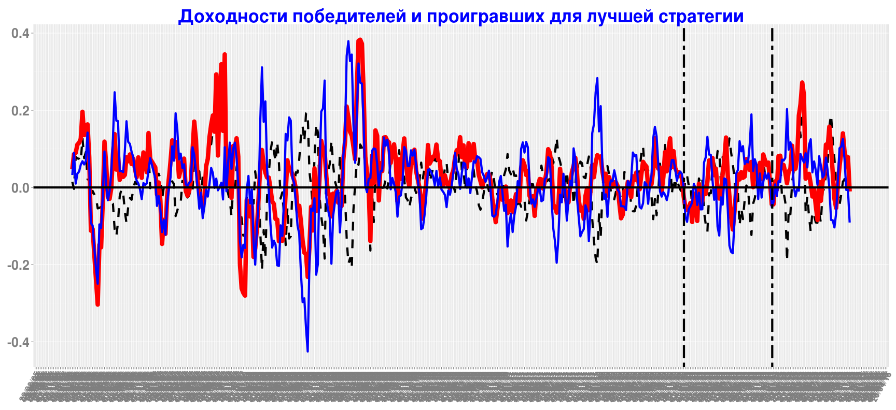 

 
 

  

### **Вхождение в победителей и проигравших для лучшей стратегии**

 
 

  

####**Рисунок  4. ** 

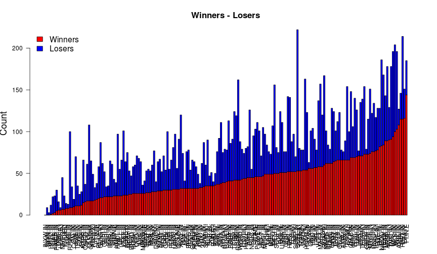 
 

 
 

  

####**Рисунок  5. ** 

 
 

 
 

  

####**Таблица 1. Вхождение компаний в победители и проигравшие для лучшей по средней доходности стратегии** 
<!--html_preserve-->

<!--/html_preserve-->

  

  

>**Вторник**

  

  

####**Рисунок  6. (вертикальные пунктирные линии - начало нового года) ** 

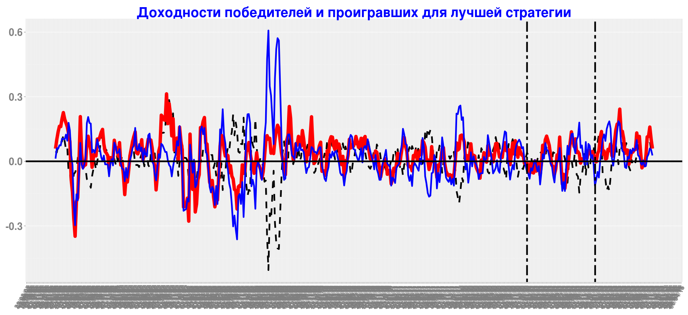 

 
 

  

### **Вхождение в победителей и проигравших для лучшей стратегии**

 
 

  

####**Рисунок  7. ** 

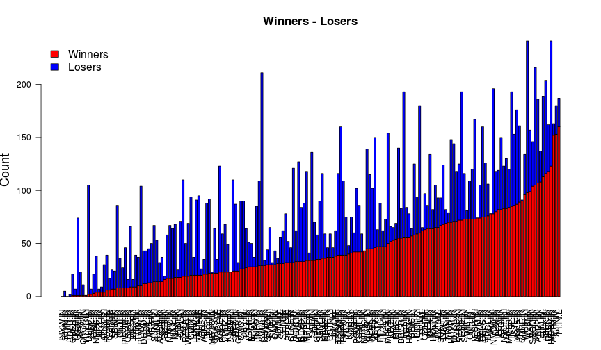 
 

 
 

  

####**Рисунок  8. ** 

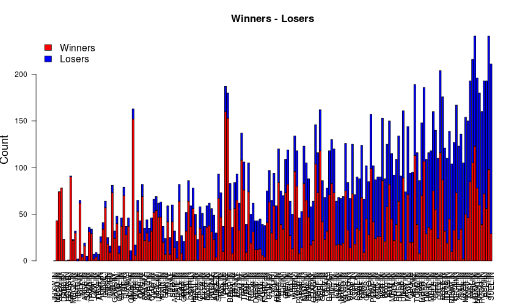 
 

 
 

  

####**Таблица 2. Вхождение компаний в победители и проигравшие для лучшей по средней доходности стратегии** 
<!--html_preserve-->

<!--/html_preserve-->

  

  

====================================================================================================================================================

## 2.  Моментум стратегии при равных весах. Ранжирование по t-статистике (бенчмарк 6% годовых - только для reality check)

 

  
>**Понедельник**

 

  

>Лучшая по t-статистике стратегия дает среднемесячную доходность  **0.72** **%**  и имеет параметры:
>период отбора -- **3** месяцев,  период ожидания -- **1** недель, период инвестирования -- **5** месяцев,  процентиль -- **0.1** 

 

 

>Bootstrap p-value равен  **0.776**

 

 

>Всего портфелей у лучшей по t-статистике стратегии -- **456** 
>Количество отрицательных доходностей у лучшей по t-статистике стратегии -- **164** ( **35.96%** )
 

 

  

####**Рисунок 9. ** 
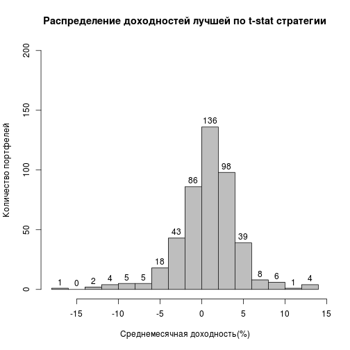 

  

 
>**Вторник**

 

  

>Лучшая по t-статистике стратегия дает среднемесячную доходность  **0.79** **%**  и имеет параметры:
>период отбора -- **3** месяцев,  период ожидания -- **1** недель, период инвестирования -- **5** месяцев,  процентиль -- **0.1** 

 

 

>Bootstrap p-value равен  **0.792**

 

 

>Всего портфелей у лучшей по t-статистике стратегии -- **456** 
>Количество отрицательных доходностей у лучшей по t-статистике стратегии -- **158** ( **34.65%** )
 

 

  

####**Рисунок 10. ** 
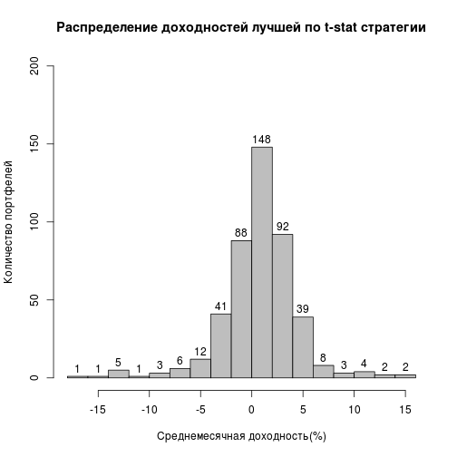 

  

 

====================================================================================================================================================
>**Понедельник**
 

  

  

####**Рисунок 11. (вертикальные пунктирные линии - начало нового года) ** 
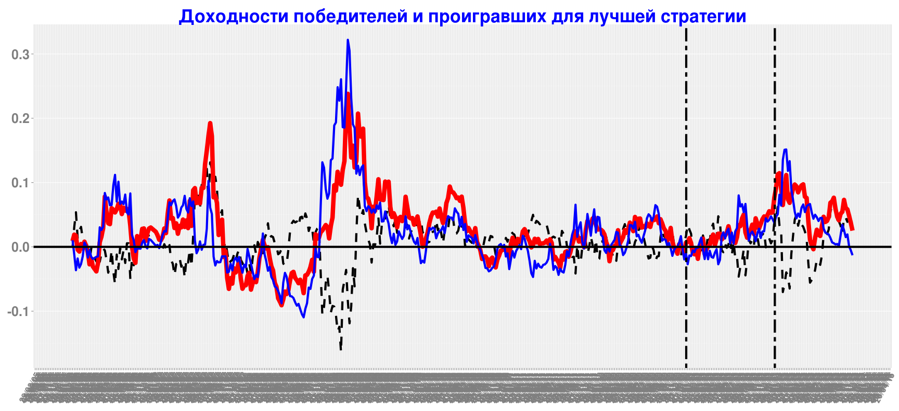 

 
 

  
### **Вхождение в победителей и проигравших для лучшей стратегии**

 
 

  

####**Рисунок  12. ** 
 

 
 

  

####**Рисунок  13. ** 
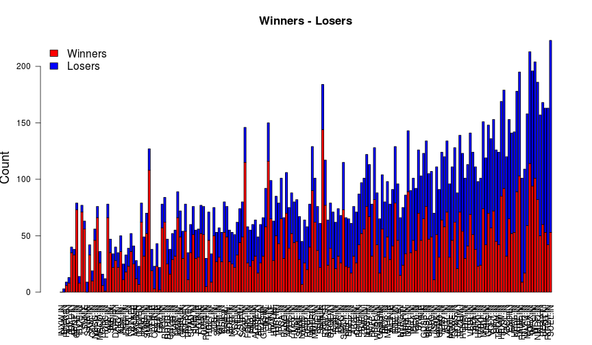 

 
 

  

####**Таблица 3. Вхождение компаний в победители и проигравшие для лучшей по t-статистике стратегии** 
<!--html_preserve-->

<!--/html_preserve-->

  

  
>**Вторник**
 

  

  

####**Рисунок 14. (вертикальные пунктирные линии - начало нового года) ** 
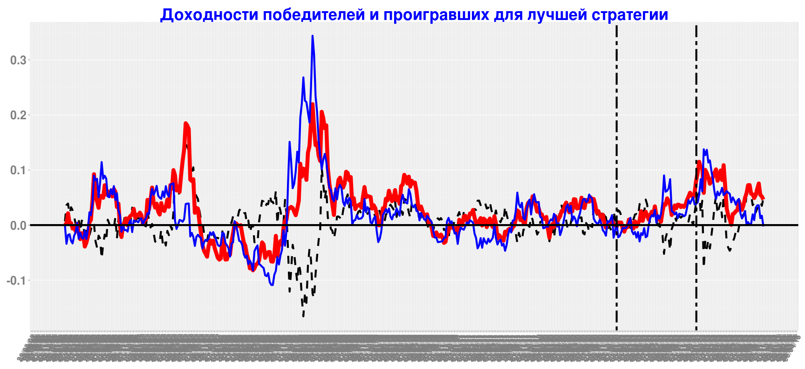 

 
 

  
### **Вхождение в победителей и проигравших для лучшей стратегии**

 
 

  

####**Рисунок  15. ** 
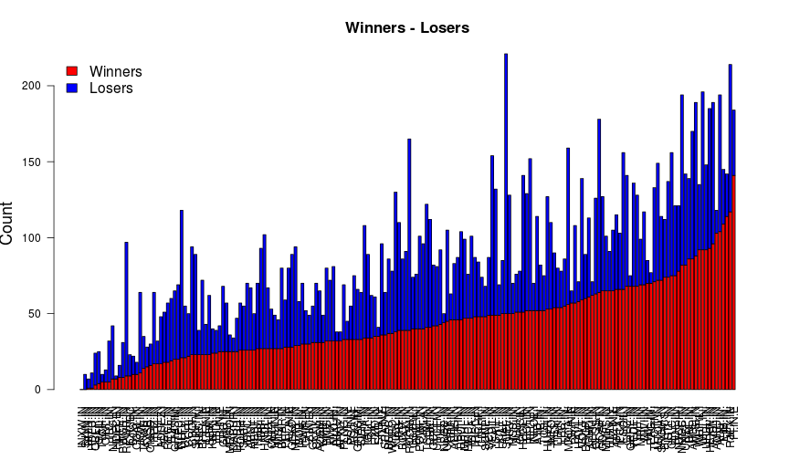 

 
 

  

####**Рисунок  16. ** 
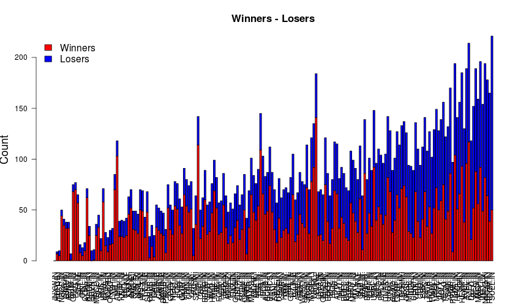 

 
 

  

####**Таблица 4. Вхождение компаний в победители и проигравшие для лучшей по t-статистике стратегии** 
<!--html_preserve-->

<!--/html_preserve-->

  

  

  

  

